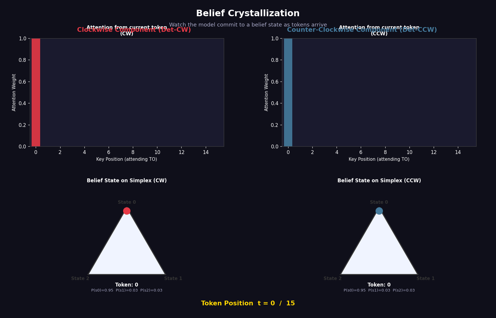

# mess3-belief-geometry

Companion code for a take-home experiment on belief state geometry in transformers trained on non-ergodic Mess3 processes.

## What this is

I trained a small transformer on sequences from a non-ergodic HMM (Mess3) and analysed the geometry of its residual stream. The main finding is that the residual stream linearly encodes the analytical belief state of the generative process — and that a model trained on only one ergodic component maps the unseen component onto the same geometric manifold.

## Files

| File | Description |
|------|-------------|
| `MATS_Simplex.ipynb` | Main Colab notebook. Run cells top to bottom. |
| `figures/` | All plots referenced in the report. |
| `report.pdf` | Written report. |

## How to run

Open `MATS_Simplex.ipynb` in Google Colab. No GPU required. Tested on Colab free tier with PyTorch 2.x.

Run all cells in order. Training takes 2-3 minutes on CPU.

## Dependencies

All standard. If running locally:

```
pip install torch numpy matplotlib scikit-learn scipy
```

## Results summary

- Residual stream linearly encodes belief states (confirmed)
- Four process types separate geometrically as context grows (confirmed)  
- CW/CCW separation precedes alpha separation (confirmed)
- Model trained on CW only maps unseen CCW onto the same manifold (inter/intra ratio 1.005)

- Permutation test: real probe accuracy 0.863, null mean 0.503, p=0.0000

## Belief Crystallization


